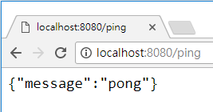
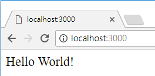
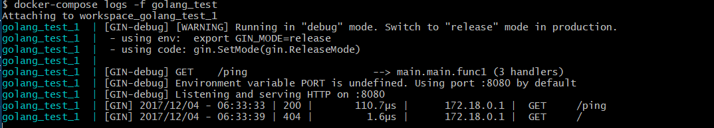
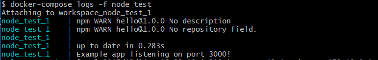

# Develop WorkSpace
Develop Golang & Node.js app quickly.

## Required
[docker & docker-compose](https://store.docker.com/search?type=edition&offering=community)

## Set Executable Path
See [docker-compose.yml](docker-compose.yml).

## Package Management
#### Golang
govendor

#### Node.js
npm

## Git Clone, Write Code and Run it !!
#### Golang
```
docker-compose up -d golang_test
```


#### Node.js
```
docker-compose up -d node_test
```


## Show Logs
#### Golang
```
docker-compose logs -f golang_test
```


#### Node.js
```
docker-compose logs -f node_test
```


## Kill All Service
```
docker-compose kill && docker-compose rm -f
```

## License

[MIT](http://opensource.org/licenses/MIT)

Copyright (c) 2017-present, Alex Lee