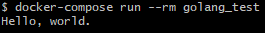

# Develop WorkSpace
Develop Golang & Node.js app quickly.

## Required
[docker & docker-compose](https://store.docker.com/search?type=edition&offering=community)

## Set Executable Path
See [docker-compose.yml](docker-compose.yml).

## Git Clone, Write Code, Run it !!
### Golang
```
docker-compose run --rm golang_test
```


### Node.js
```
docker-compose run --rm node_test
```
